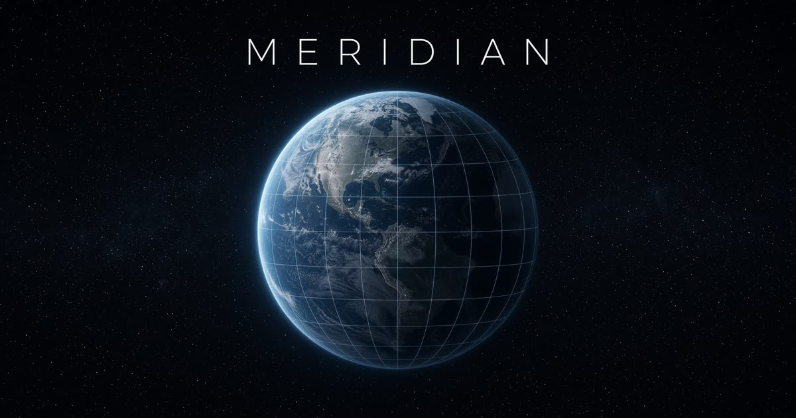

# Meridian

精選地標 3D 地球儀。拖曳旋轉，點擊發光標記以聚焦。

<p align="center">
  
</p>

全視埠 WebGL 場景：真實地球貼圖、日夜交界、雲層、大氣層光暈，以及 18 處可聚焦的世界地標。自動旋轉會在操作時暫停，相機以球面插值平滑飛向選定位置。

## 功能

- 可拖曳、縮放的 3D 地球，帶阻尼慣性
- 柔和環境光、夜間城市燈火、Fresnel 大氣層
- 發光地標；點擊標記或側欄列表即可聚焦
- 自動旋轉：互動時暫停，閒置後恢復
- 桌面側欄 / 手機底部面板，含座標與簡介
- 尊重 `prefers-reduced-motion`

## 操作

| 動作 | 桌面 | 觸控 |
| --- | --- | --- |
| 旋轉 | 拖曳 | 單指拖曳 |
| 縮放 | 滾輪 | 雙指捏合 |
| 聚焦地標 | 點擊標記或列表 | 點擊標記或展開列表 |
| 暫停自動旋轉 | 右上角切換 | 同上 |
| 回到預設視角 | 羅盤按鈕 | 同上 |
| 取消聚焦 | `Esc` 或關閉 | 關閉 |

## 地標

18 處，依區域排列：極地、歐洲、非洲與西亞、亞洲、大洋洲、美洲。

雷克雅維克、特羅姆瑟、麥克默多站、倫敦、巴黎、威尼斯、開羅、開普敦、佩特拉、杜拜、台北、京都、新加坡、吳哥窟、雪梨、紐約、馬丘比丘、里約熱內盧。

資料在 [`src/lib/locations.ts`](src/lib/locations.ts)。

## 技術棧

- [React 19](https://react.dev/) + [TanStack Start](https://tanstack.com/start)
- [Three.js](https://threejs.org/) · [React Three Fiber](https://r3f.docs.pmnd.rs/) · [drei](https://github.com/pmndrs/drei)
- [Tailwind CSS v4](https://tailwindcss.com/) · [Zustand](https://github.com/pmndrs/zustand)
- Node 22

## 開始使用

需要 Node.js 22 與 npm。

```bash
git clone https://github.com/richie7p/glow-raven-quartz-opal.git
cd glow-raven-quartz-opal
npm install
npm run dev
```

開發伺服器預設聽 `http://localhost:8080`。

```bash
npm run build       # 生產建置
npm run typecheck   # TypeScript
```

## 結構

```text
src/
  components/globe/     地球、大氣、星空、標記、相機
  components/overlay/   地標列表與控制列
  lib/locations.ts      精選地標
  lib/geo.ts            經緯度 ↔ 球面座標
  lib/store.ts          選取、旋轉、相機指令
  routes/               TanStack 檔案路由
public/textures/        地球日/夜/法線/高光/雲層貼圖
```

## 授權

私有倉庫。地球貼圖取自 three.js 範例資源與 NASA 風格藍大理石公開影像。
